# BigQuery Release Notes Viewer — Architecture & Code Walkthrough

This document explains the file structure, directory hierarchy, and inner workings of the BigQuery Release Notes Viewer codebase. It maps the files in the repository to the live execution flow of the application.

---

## 1. Project Directory Hierarchy

Below is the directory tree of the `bq-releases-notes` project:

```text
bq-releases-notes/
├── .gitignore              # Specifies intentionally untracked files to ignore
├── ARCHITECTURE.md         # Architecture documentation (this file)
├── README.md               # Quickstart guide and API documentation
├── app.py                  # Flask backend server & feed parsing logic
├── requirements.txt        # Python dependency manifest
├── templates/              # HTML template directory
│   └── index.html          # Main application page (Jinja2 template)
└── static/                 # Static assets directory
    ├── css/
    │   └── style.css       # CSS Design System (Theme, glassmorphism, responsive)
    └── js/
        └── app.js          # Client-side JavaScript (Fetch, state management, features)
```

---

## 2. File-by-File Explanation

Each file in the workspace has a distinct responsibility. Here is how they are split across the **Backend**, **Frontend**, and **Configuration** layers:

### A. Backend Layer (Python & Flask)

#### 1. [app.py](file:///C:/Users/User/Documents/5%20Day%20AI%20Agents%20Intensive%20Vibe%20Coding%20Course%20With%20Google/Day2/bq-releases-notes/app.py)
* **Role**: The core engine of the server.
* **Responsibilities**:
  * Initializes the Flask application instance (`app = Flask(__name__)`).
  * Runs the local web server on port `5000` with debug mode.
  * Fetches the Google Cloud BigQuery release notes XML feed via the `requests` library.
  * Parses the XML feed into Python dictionaries using `feedparser`.
  * Sanitizes the feed's HTML content into plain text for social sharing previews using regex and `html.unescape`.
  * Exposes two main routes:
    * `/` (returns the rendered HTML template)
    * `/api/releases` (returns parsed notes as JSON)

### B. Frontend Layer (HTML, CSS, JS)

#### 2. [templates/index.html](file:///C:/Users/User/Documents/5%20Day%20AI%20Agents%20Intensive%20Vibe%20Coding%20Course%20With%20Google/Day2/bq-releases-notes/templates/index.html)
* **Role**: Structural skeleton of the Single Page Application (SPA).
* **Responsibilities**:
  * Loads font assets (Google Fonts - Inter) and links styles and scripts.
  * Contains placeholders for the loading skeleton (`#loadingState`), error messages (`#errorState`), and the release notes grid (`#notesGrid`).
  * Renders the modal overlay for composing X/Twitter posts (`#tweetModal`).
  * Features the header actions: the "Refresh" button, the "Export CSV" button, and the dark/light "Theme Toggle".

#### 3. [static/css/style.css](file:///C:/Users/User/Documents/5%20Day%20AI%20Agents%20Intensive%20Vibe%20Coding%20Course%20With%20Google/Day2/bq-releases-notes/static/css/style.css)
* **Role**: Premium Design System, styling, and animations.
* **Responsibilities**:
  * **Design Tokens**: Configures variables (`:root`) for color codes, gradients, border radii, shadows, and transition times.
  * **Theme Override**: Overrides variables under the `[data-theme="light"]` selector to dynamically swap between dark and light themes.
  * **Aesthetics**: Implements ambient animated background blobs, glassmorphic backdrops, glowing hovers, and clean card margins.
  * **Layouts**: Controls the responsive grid structure via media queries for tablets (`@media (max-width: 860px)`) and phones (`@media (max-width: 600px)`).

#### 4. [static/js/app.js](file:///C:/Users/User/Documents/5%20Day%20AI%20Agents%20Intensive%20Vibe%20Coding%20Course%20With%20Google/Day2/bq-releases-notes/static/js/app.js)
* **Role**: Client-side logic, data loading, rendering, and feature implementation.
* **Responsibilities**:
  * **Lifecycle Management**: Triggers `fetchReleaseNotes()` automatically on page load.
  * **Asynchronous Fetch**: Requests `/api/releases` and processes the returned JSON.
  * **DOM Manipulation**: Dynamically builds the card list, inserting data safely with an HTML escaper to prevent XSS.
  * **Theme Switching**: Handles theme toggle clicks, applies attributes to the `<html>` root, and persists settings via `localStorage`.
  * **CSV Export**: Combines the notes array into CSV formatting and programmatically triggers a browser download.
  * **Clipboard Utility**: Copies the note details (title, summary, link) to the clipboard.
  * **X/Twitter Share Modal**: Sets up a draft post, keeps track of character limits, and routes to the X/Twitter Web Intent URL in a separate window.

---

## 3. How the Code Execution Works (Lifecycle Flow)

The following diagram illustrates how the frontend and backend files orchestrate the entire process from initial load to user actions:

```mermaid
sequenceDiagram
    autonumber
    actor User
    participant HTML as templates/index.html
    participant JS as static/js/app.js
    participant Server as app.py (Flask)
    participant Feed as Google XML Feed

    %% Page Load Flow
    User->>HTML: Opens http://127.0.0.1:5000/
    HTML->>Server: GET /
    Server-->>HTML: Serves templates/index.html
    Note over HTML: Browser loads style.css and app.js

    %% Fetch Flow
    Note over JS: app.js starts fetchReleaseNotes()
    JS->>HTML: Show Loading Spinner
    JS->>Server: GET /api/releases
    Server->>Feed: Fetch Feed XML
    Feed-->>Server: Raw XML Response
    Note over Server: feedparser parses XML<br/>clean_html() extracts plain text
    Server-->>JS: JSON (success: true, notes: [...])
    JS->>HTML: Hide Spinner
    Note over JS: renderNotes() creates HTML elements
    JS->>HTML: Renders card grid and animation effects

    %% User Interaction Flow
    rect rgb(29, 33, 41)
        Note over User, HTML: Interactive User Actions
        User->>HTML: Clicks "Theme Toggle"
        HTML->>JS: toggleTheme()
        JS->>HTML: Swap [data-theme] attribute & save theme choice
        
        User->>HTML: Clicks "Export CSV"
        HTML->>JS: exportToCSV()
        JS-->>User: Trigger CSV download

        User->>HTML: Clicks "Post on X"
        HTML->>JS: openTweetModal(index)
        JS->>HTML: Show modal with character counter
        User->>HTML: Click "Post on X" in Modal
        HTML->>JS: postTweet()
        JS-->>User: Opens window with X Compose Intent
    end
```



---

## 4. File Interoperability Matrix

The table below describes how changes in one file cascade or relate to other files in the hierarchy:

| Origin File | Target File / Element | Dependency / Interoperability Description |
|---|---|---|
| **[app.py](file:///C:/Users/User/Documents/5%20Day%20AI%20Agents%20Intensive%20Vibe%20Coding%20Course%20With%20Google/Day2/bq-releases-notes/app.py)** | [templates/index.html](file:///C:/Users/User/Documents/5%20Day%20AI%20Agents%20Intensive%20Vibe%20Coding%20Course%20With%20Google/Day2/bq-releases-notes/templates/index.html) | Exposes the host route `/` which loads this template. |
| **[app.py](file:///C:/Users/User/Documents/5%20Day%20AI%20Agents%20Intensive%20Vibe%20Coding%20Course%20With%20Google/Day2/bq-releases-notes/app.py)** | [static/js/app.js](file:///C:/Users/User/Documents/5%20Day%20AI%20Agents%20Intensive%20Vibe%20Coding%20Course%20With%20Google/Day2/bq-releases-notes/static/js/app.js) | Exposes `/api/releases` API. If JSON fields change in `app.py`, `app.js` must update its reference keys (`note.title`, `note.content_html`, etc.). |
| **[templates/index.html](file:///C:/Users/User/Documents/5%20Day%20AI%20Agents%20Intensive%20Vibe%20Coding%20Course%20With%20Google/Day2/bq-releases-notes/templates/index.html)** | [static/css/style.css](file:///C:/Users/User/Documents/5%20Day%20AI%20Agents%20Intensive%20Vibe%20Coding%20Course%20With%20Google/Day2/bq-releases-notes/static/css/style.css) | Defines DOM structure and class selectors (`.notes-grid`, `.note-card`, etc.) styled by `style.css`. |
| **[templates/index.html](file:///C:/Users/User/Documents/5%20Day%20AI%20Agents%20Intensive%20Vibe%20Coding%20Course%20With%20Google/Day2/bq-releases-notes/templates/index.html)** | [static/js/app.js](file:///C:/Users/User/Documents/5%20Day%20AI%20Agents%20Intensive%20Vibe%20Coding%20Course%20With%20Google/Day2/bq-releases-notes/static/js/app.js) | Emits event handlers (e.g. `onclick="toggleTheme()"`) and contains unique IDs (e.g., `#notesGrid`, `#btnRefresh`) loaded by `app.js`. |
| **[static/js/app.js](file:///C:/Users/User/Documents/5%20Day%20AI%20Agents%20Intensive%20Vibe%20Coding%20Course%20With%20Google/Day2/bq-releases-notes/static/js/app.js)** | [static/css/style.css](file:///C:/Users/User/Documents/5%20Day%20AI%20Agents%20Intensive%20Vibe%20Coding%20Course%20With%20Google/Day2/bq-releases-notes/static/css/style.css) | Modifies the document root theme attributes (`data-theme`), matching CSS theme selectors, and sets class lists like `.copied`, `.show`, or `.loading`. |
