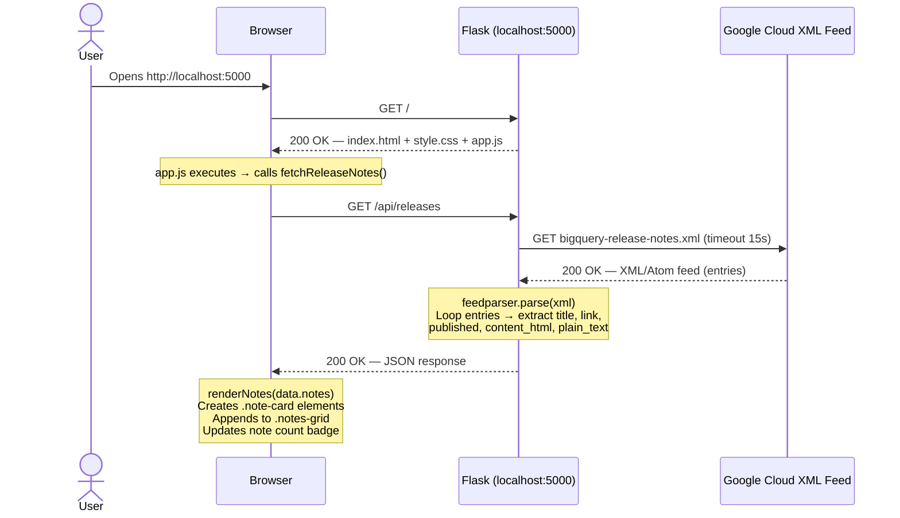
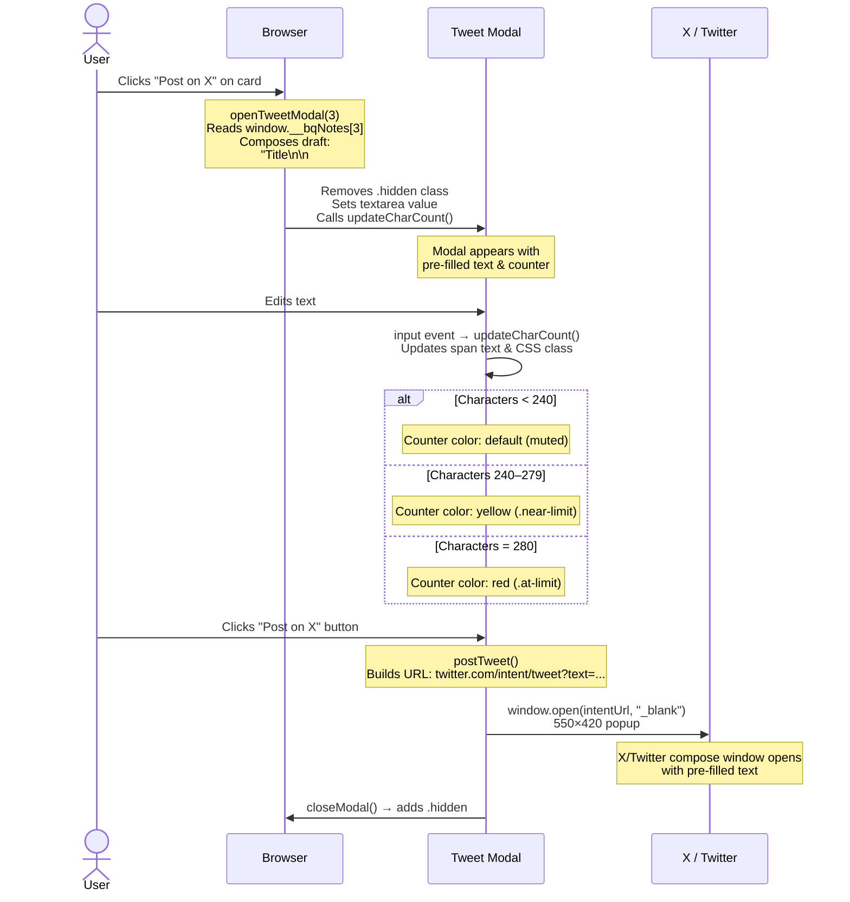

# BigQuery Release Notes — Codebase Explanation

> A detailed walkthrough of every layer of the application.

---

## 1. Project Overview

**BigQuery Release Notes** is a single-page web application that fetches the latest Google BigQuery release notes from an official XML/Atom feed and displays them in a visually rich, dark-themed card grid. Users can browse updates and share any release note directly to X/Twitter via a compose modal.

### Tech Stack

| Layer | Technology | Version | Role |
|---|---|---|---|
| **Backend** | [Flask](file:///C:/Users/User/Documents/5%20Day%20AI%20Agents%20Intensive%20Vibe%20Coding%20Course%20With%20Google/Day2/bq-releases-notes/app.py) | 3.1.1 | Web server, routing, template rendering |
| **Feed Parsing** | feedparser | 6.0.11 | Parses the Atom/RSS XML from Google Cloud |
| **HTTP Client** | requests | 2.32.3 | Fetches the remote XML feed |
| **Frontend** | Vanilla HTML / CSS / JS | — | UI rendering, interactivity, tweet sharing |
| **Typography** | Google Fonts (Inter) | — | Modern, clean typeface |

### Project Structure

```
bq-releases-notes/
├── app.py                  ← Flask server (routes + feed logic)
├── requirements.txt        ← Python dependencies
├── templates/
│   └── index.html          ← Jinja2 template (single page)
└── static/
    ├── css/
    │   └── style.css       ← Full design system
    └── js/
        └── app.js          ← Client-side fetch, render, tweet modal
```

---

## 2. Main Features

| # | Feature | Description |
|---|---|---|
| 1 | **Live XML Feed** | Fetches BigQuery release notes from `cloud.google.com/feeds/bigquery-release-notes.xml` on every page load or refresh. |
| 2 | **Dark-Themed Card Grid** | Each release note is rendered as a glassmorphic card with hover effects, gradient accents, and staggered entrance animations. |
| 3 | **Refresh Button + Spinner** | A gradient pill button triggers a re-fetch; the refresh icon spins while loading. |
| 4 | **Share on X/Twitter** | Each card has a "Post on X" button that opens a compose modal with pre-filled tweet text (title + hashtags + link). |
| 5 | **Character Counter** | The tweet modal shows a live `0 / 280` counter with color-coded feedback (yellow at 240+, red at 280). |
| 6 | **Responsive Design** | CSS breakpoints at 860 px and 600 px adapt the grid, header, and modal for tablets and phones. |
| 7 | **Ambient Background** | Three large, blurred, slowly floating radial-gradient blobs create an atmospheric backdrop. |

---

## 3. Server-Side Breakdown — [app.py](file:///C:/Users/User/Documents/5%20Day%20AI%20Agents%20Intensive%20Vibe%20Coding%20Course%20With%20Google/Day2/bq-releases-notes/app.py)

### 3.1 Flask App Setup

```python
from flask import Flask, render_template, jsonify
import requests
import feedparser
from datetime import datetime
import html
import re

app = Flask(__name__)

BQ_FEED_URL = "https://cloud.google.com/feeds/bigquery-release-notes.xml"
```

- A standard Flask app is created with `Flask(__name__)`.
- `BQ_FEED_URL` is a module-level constant pointing to the official Google Cloud Atom feed for BigQuery release notes.

> [!NOTE]
> The app uses **three** key libraries:
> - `requests` — makes the outbound HTTP call to Google Cloud
> - `feedparser` — parses the XML/Atom response into Python objects
> - `html` / `re` — used for sanitising HTML content into plain text

---

### 3.2 The `clean_html()` Function

```python
def clean_html(raw_html):
    """Strip HTML tags and decode entities for plain text summaries."""
    text = re.sub(r"<[^>]+>", " ", raw_html)   # 1. Remove all HTML tags
    text = html.unescape(text)                   # 2. Decode &amp; → &, etc.
    text = re.sub(r"\s+", " ", text).strip()     # 3. Collapse whitespace
    return text
```

**Why is this needed?** The XML feed entries contain rich HTML (lists, links, `<code>` tags, etc.). For the tweet preview (`plain_text`), we need a clean, tag-free string that fits in 280 characters.

| Step | What it does | Example |
|---|---|---|
| `re.sub(r"<[^>]+>", " ", …)` | Replaces every HTML tag with a space | `<b>BigQuery</b>` → ` BigQuery ` |
| `html.unescape(…)` | Decodes HTML entities | `&amp;` → `&` |
| `re.sub(r"\s+", " ", …).strip()` | Normalizes multiple spaces/newlines to a single space | `"  hello   world  "` → `"hello world"` |

---

### 3.3 The `fetch_release_notes()` Function

This is the core data-fetching function. Here's the step-by-step flow:

```python
def fetch_release_notes():
    """Fetch and parse the BigQuery release notes XML feed."""
    try:
        # Step 1: HTTP GET to Google Cloud
        resp = requests.get(BQ_FEED_URL, timeout=15)
        resp.raise_for_status()

        # Step 2: Parse XML with feedparser
        feed = feedparser.parse(resp.content)

        notes = []
        for entry in feed.entries:
            # Step 3: Extract publication date
            published = ""
            if hasattr(entry, "published_parsed") and entry.published_parsed:
                published = datetime(*entry.published_parsed[:6]).strftime(
                    "%B %d, %Y"
                )
            elif hasattr(entry, "updated_parsed") and entry.updated_parsed:
                published = datetime(*entry.updated_parsed[:6]).strftime(
                    "%B %d, %Y"
                )

            # Step 4: Extract HTML content
            content_html = ""
            if hasattr(entry, "content") and entry.content:
                content_html = entry.content[0].get("value", "")
            elif hasattr(entry, "summary"):
                content_html = entry.summary

            # Step 5: Generate plain-text snippet (capped at 280 chars)
            plain_text = clean_html(content_html)

            notes.append(
                {
                    "title": entry.get("title", "Untitled"),
                    "link": entry.get("link", ""),
                    "published": published,
                    "content_html": content_html,
                    "plain_text": plain_text[:280],
                }
            )

        return {"success": True, "notes": notes, "count": len(notes)}

    except requests.RequestException as e:
        return {"success": False, "error": str(e), "notes": [], "count": 0}
```

| Step | Detail |
|---|---|
| **1. HTTP GET** | Uses `requests.get()` with a 15-second timeout. `raise_for_status()` throws on 4xx/5xx. |
| **2. Parse XML** | `feedparser.parse(resp.content)` turns the raw bytes into a `FeedParserDict` with `.entries`. |
| **3. Date extraction** | Tries `published_parsed` first, falls back to `updated_parsed`. Formats as e.g. `"June 18, 2026"`. |
| **4. Content extraction** | Prefers `entry.content[0]["value"]` (Atom content element), falls back to `entry.summary`. |
| **5. Plain text** | Calls `clean_html()` and truncates to 280 characters for tweet previews. |
| **Error handling** | Any `requests.RequestException` is caught and returned as `{"success": False, "error": "…"}`. |

> [!IMPORTANT]
> The function never raises exceptions to the caller — it always returns a well-structured dict with `success`, `notes`, `count`, and optionally `error`. This makes the API response predictable for the frontend.

---

### 3.4 The Two Routes

#### Route 1: `GET /` — Serve the HTML page

```python
@app.route("/")
def index():
    return render_template("index.html")
```

Simply renders the Jinja2 template at `templates/index.html`. No data is passed — the page loads empty and fetches data via JavaScript.

#### Route 2: `GET /api/releases` — JSON API

```python
@app.route("/api/releases")
def api_releases():
    data = fetch_release_notes()
    return jsonify(data)
```

Calls `fetch_release_notes()` and serializes the result to JSON. This is the endpoint the frontend's `fetch()` call hits.

#### App Entry Point

```python
if __name__ == "__main__":
    app.run(debug=True, port=5000)
```

Runs the development server on `http://localhost:5000` with debug mode enabled.

---

## 4. Client-Side Breakdown

### 4.1 HTML Structure — [index.html](file:///C:/Users/User/Documents/5%20Day%20AI%20Agents%20Intensive%20Vibe%20Coding%20Course%20With%20Google/Day2/bq-releases-notes/templates/index.html)

The HTML follows a clear section-based layout:

```
┌─────────────────────────────────────────┐
│  <head>                                 │
│    • Meta charset, viewport             │
│    • <title>, <meta description>        │
│    • Google Fonts preconnect + load     │
│    • style.css link                     │
└─────────────────────────────────────────┘
┌─────────────────────────────────────────┐
│  Ambient Background  (.ambient-bg)      │
│    • blob-1  (blue, top-right)          │
│    • blob-2  (teal, bottom-left)        │
│    • blob-3  (purple, center)           │
└─────────────────────────────────────────┘
┌─────────────────────────────────────────┐
│  Header  (.header)                      │
│    ├── Brand icon (SVG) + title + sub   │
│    └── Actions: note count + Refresh btn│
└─────────────────────────────────────────┘
┌─────────────────────────────────────────┐
│  Main Content  (.main)                  │
│    ├── Loading State (.loading-state)   │
│    │     spinner + "Fetching…" text     │
│    ├── Error State (.error-state)       │
│    │     ⚠️ icon + message + retry btn  │
│    └── Notes Grid (.notes-grid)         │
│          dynamically populated cards    │
└─────────────────────────────────────────┘
┌─────────────────────────────────────────┐
│  Tweet Modal  (.modal-overlay)          │
│    ├── Header: "Share on X" + close btn │
│    ├── Body: <textarea> + char counter  │
│    └── Footer: Cancel + "Post on X" btn │
└─────────────────────────────────────────┘
```

> [!TIP]
> The `<head>` includes SEO elements: a descriptive `<title>` tag and a `<meta name="description">`. The Google Fonts `<link>` uses `preconnect` for faster font loading.

---

### 4.2 CSS Design System — [style.css](file:///C:/Users/User/Documents/5%20Day%20AI%20Agents%20Intensive%20Vibe%20Coding%20Course%20With%20Google/Day2/bq-releases-notes/static/css/style.css)

The CSS is organized into clearly labeled sections and uses a design-token approach with CSS custom properties.

#### CSS Custom Properties (Design Tokens)

```css
:root {
    /* Backgrounds */
    --bg-primary: #06060f;
    --bg-secondary: #0d0d1a;
    --bg-card: rgba(255, 255, 255, 0.04);
    --bg-card-hover: rgba(255, 255, 255, 0.07);
    --bg-glass: rgba(255, 255, 255, 0.06);

    /* Borders */
    --border-subtle: rgba(255, 255, 255, 0.08);
    --border-accent: rgba(66, 133, 244, 0.3);

    /* Typography */
    --text-primary: #e8eaf0;
    --text-secondary: #9ba3b5;
    --text-muted: #5f6780;

    /* Accents */
    --accent-blue: #4285f4;
    --accent-teal: #00bfa5;
    --accent-purple: #a259ff;
    --accent-gradient: linear-gradient(135deg, #4285f4, #00bfa5);

    /* Spacing & Radius */
    --radius-sm: 8px;  --radius-md: 14px;
    --radius-lg: 20px; --radius-xl: 24px;

    /* Transitions */
    --transition-fast: 0.2s cubic-bezier(0.4, 0, 0.2, 1);
    --transition-smooth: 0.35s cubic-bezier(0.4, 0, 0.2, 1);
    --transition-spring: 0.5s cubic-bezier(0.34, 1.56, 0.64, 1);
}
```

#### Key Design Techniques

| Technique | Where | How |
|---|---|---|
| **Ambient Blobs** | `.blob-1`, `.blob-2`, `.blob-3` | Large `radial-gradient` circles with `filter: blur(120px)`, animated via `@keyframes blobFloat` with translation & scale changes over 20 s. |
| **Glassmorphism** | `.header`, `.modal-overlay` | `backdrop-filter: blur(20px) saturate(1.4)` over semi-transparent backgrounds. |
| **Gradient Text** | `.brand h1` | `background: var(--accent-gradient)` + `-webkit-background-clip: text` + `-webkit-text-fill-color: transparent`. |
| **Card Entrance** | `.note-card` | `@keyframes cardIn` fades from `opacity: 0; translateY(20px)` with staggered `animation-delay` per card. |
| **Hover Glow** | `.note-card:hover` | Reveals a 3 px gradient bar via `::before`, shifts `translateY(-3px)`, and applies a blue box-shadow glow. |
| **Spinner** | `.btn-refresh.loading .refresh-icon` | `@keyframes spin` rotates the SVG 360° in 0.8 s, triggered by adding a `.loading` class. |
| **Character Limit Colors** | `.char-count.near-limit / .at-limit` | Yellow (`#f4b400`) at 240+ chars, red (`#ea4335`) at 280. |

#### Responsive Breakpoints

```css
@media (max-width: 860px) {
    .notes-grid { grid-template-columns: 1fr; }   /* Stack to single column */
}

@media (max-width: 600px) {
    .header-inner { flex-direction: column; }      /* Stack header vertically */
    .main { padding: 20px 16px 60px; }             /* Tighter padding */
    .note-card { padding: 20px; }                  /* Smaller card padding */
}
```

---

### 4.3 JavaScript Logic — [app.js](file:///C:/Users/User/Documents/5%20Day%20AI%20Agents%20Intensive%20Vibe%20Coding%20Course%20With%20Google/Day2/bq-releases-notes/static/js/app.js)

#### DOM References

The file starts by caching all DOM elements needed throughout the app's lifecycle:

```javascript
const notesGrid    = document.getElementById("notesGrid");
const loadingState = document.getElementById("loadingState");
const errorState   = document.getElementById("errorState");
const errorMessage = document.getElementById("errorMessage");
const noteCount    = document.getElementById("noteCount");
const btnRefresh   = document.getElementById("btnRefresh");
const refreshIcon  = document.getElementById("refreshIcon");
const refreshText  = document.getElementById("refreshText");
const tweetModal   = document.getElementById("tweetModal");
const tweetText    = document.getElementById("tweetText");
const charCount    = document.getElementById("charCount");

let currentTweetLink = "";
```

#### `fetchReleaseNotes()` — The Main Entry Point

```javascript
async function fetchReleaseNotes() {
    setLoading(true);
    try {
        const response = await fetch("/api/releases");
        if (!response.ok) throw new Error(`HTTP ${response.status}`);
        const data = await response.json();

        if (!data.success) {
            showError(data.error || "Failed to fetch release notes.");
            return;
        }

        renderNotes(data.notes);
        noteCount.textContent = `${data.count} updates`;
    } catch (err) {
        showError(err.message);
    } finally {
        setLoading(false);
    }
}
```

This function:
1. Shows the loading spinner via `setLoading(true)`
2. Calls `fetch("/api/releases")` — the Flask JSON endpoint
3. On success, passes the `notes` array to `renderNotes()`
4. Updates the badge with e.g. `"15 updates"`
5. On any failure (network, HTTP, JSON), calls `showError()`
6. Always clears the loading state in `finally`

#### `renderNotes()` — Building the Card DOM

```javascript
function renderNotes(notes) {
    errorState.classList.add("hidden");
    notesGrid.classList.remove("hidden");
    notesGrid.innerHTML = "";

    notes.forEach((note, i) => {
        const card = document.createElement("div");
        card.className = "note-card";
        card.style.animationDelay = `${Math.min(i * 0.06, 0.8)}s`;
        card.innerHTML = `
            <span class="note-date">…</span>
            <h2 class="note-title"><a href="…">…</a></h2>
            <div class="note-content">…</div>
            <div class="note-actions">
                <button class="btn-tweet" onclick="openTweetModal(${i})">Post on X</button>
                <a href="…" class="btn-read-more">Read more →</a>
            </div>`;
        notesGrid.appendChild(card);
    });

    window.__bqNotes = notes;  // Store for tweet modal access
}
```

> [!NOTE]
> Each card gets a staggered `animationDelay` of `i * 60ms`, capped at `800ms`, which creates a cascading entrance effect. The raw `content_html` from the server is injected directly (it contains formatted HTML from Google), while `title`, `link`, and `published` are sanitized through `escapeHtml()`.

#### State Management: `setLoading()` and `showError()`

```javascript
function setLoading(isLoading) {
    if (isLoading) {
        loadingState.classList.remove("hidden");
        notesGrid.classList.add("hidden");
        errorState.classList.add("hidden");
        btnRefresh.classList.add("loading");       // ← triggers CSS spinner
        btnRefresh.disabled = true;
        refreshText.textContent = "Loading…";
    } else {
        loadingState.classList.add("hidden");
        btnRefresh.classList.remove("loading");
        btnRefresh.disabled = false;
        refreshText.textContent = "Refresh";
    }
}
```

The app has **three mutually exclusive view states**, managed by toggling the `.hidden` class:

| State | Visible Element | When |
|---|---|---|
| **Loading** | `.loading-state` | Fetching data from API |
| **Error** | `.error-state` | Network failure, HTTP error, or `success: false` |
| **Content** | `.notes-grid` | Notes fetched successfully |

#### `escapeHtml()` Utility

```javascript
function escapeHtml(str) {
    const el = document.createElement("span");
    el.textContent = str || "";
    return el.innerHTML;
}
```

A clever DOM-based escape: by setting `textContent` the browser treats the string as raw text, then reading `innerHTML` gives back the HTML-entity-encoded version. This safely prevents XSS for user-controllable fields like `title` and `link`.

#### Initialization

```javascript
fetchReleaseNotes();   // Auto-load on page open
```

The last line kicks off the first data fetch as soon as the script loads.

---

## 5. Sample Request-Response Flow



### Sample JSON Response

The `/api/releases` endpoint returns:

```json
{
  "success": true,
  "count": 15,
  "notes": [
    {
      "title": "BigQuery release notes | June 18, 2026",
      "link": "https://cloud.google.com/bigquery/docs/release-notes#June_18_2026",
      "published": "June 18, 2026",
      "content_html": "<p>You can now use <code>VECTOR_SEARCH</code> with ...</p>",
      "plain_text": "You can now use VECTOR_SEARCH with approximate ..."
    },
    {
      "title": "BigQuery release notes | June 10, 2026",
      "link": "https://cloud.google.com/bigquery/docs/release-notes#June_10_2026",
      "published": "June 10, 2026",
      "content_html": "<ul><li>New IAM condition support for ...</li></ul>",
      "plain_text": "New IAM condition support for ..."
    }
  ]
}
```

> [!NOTE]
> On error the response looks like:
> ```json
> { "success": false, "error": "Connection timed out", "notes": [], "count": 0 }
> ```

---

## 6. Tweet Flow



### Step-by-Step Walkthrough

1. **User clicks "Post on X"** on a release note card → calls `openTweetModal(index)`.
2. **`openTweetModal(index)`** retrieves the note from `window.__bqNotes[index]` and composes a draft:
   ```
   BigQuery release notes | June 18, 2026

   #BigQuery #GoogleCloud
   https://cloud.google.com/bigquery/docs/release-notes#June_18_2026
   ```
3. The draft is capped at 280 characters and set as the `<textarea>` value.
4. `updateCharCount()` is called immediately to sync the counter display.
5. The modal overlay fades in (CSS `@keyframes fadeIn`) and the modal scales in (CSS `@keyframes modalIn`).
6. **As the user types**, the `input` event listener calls `updateCharCount()` which:
   - Reads `tweetText.value.length`
   - Updates the `<span id="charCount">` text
   - Adds `.near-limit` (yellow) at 240+ or `.at-limit` (red) at 280
7. **User clicks "Post on X"** → `postTweet()` builds a [Twitter Web Intent](https://developer.x.com/en/docs/twitter-for-websites/tweet-button/guides/web-intent) URL:
   ```
   https://twitter.com/intent/tweet?text=<encoded text>
   ```
   and opens it in a 550×420 popup window.
8. The modal closes via `closeModal()`.

> [!TIP]
> The modal can also be dismissed by:
> - Clicking the **✕** close button
> - Clicking the **Cancel** button
> - Clicking the dark **overlay** area outside the modal
> - Pressing the **Escape** key
